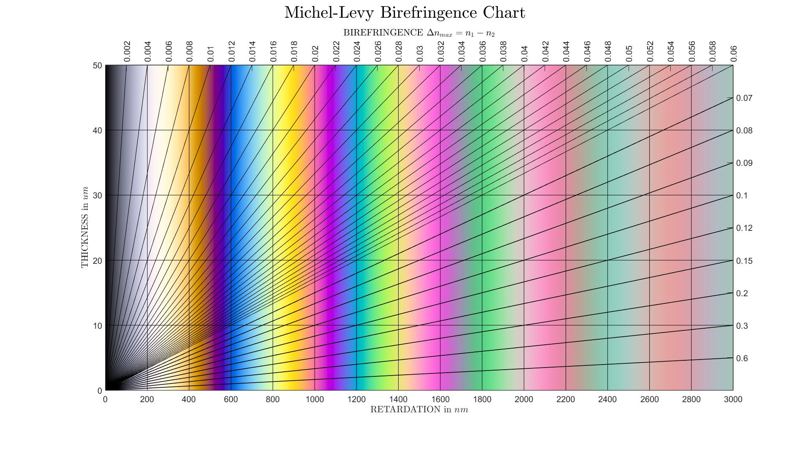

# Michel-Levy Birefringence Chart

This Matlab script generates the Michel-Levy Birefringence Chart of Nematic liquid crystal. The liquid crystal is analysed using crossed polarizer and analyser. The transmission intensity of the light under different wavelength is expressed as below:

$$
T=\sin^{2}{\left(2\chi\right)}\sin^{2}{\left(\frac{\pi\Delta n d}{\lambda_{0}}\right)}$

$$

where:

$\chi$ is the angle between the director of the liquid crystal molecule and the polarization of the light.

$d$ is the distance between polarizer and analyzer (thickness).

$\lambda_{0}$ is the wavelength of the input light.

$\Delta n=n_{e}-n_{o}$, where $n_{e}$ is the refractive index parallel to the director of the liquid crystal and $n_{o}$ is the refractive index perpendicular to the director of the liquid crystal.

# The following MATLAB tool box is required to run the script.

To use function [rspd2xyz.m](https://viewer.mathworks.com/?viewer=plain_code&url=https%3A%2F%2Fuk.mathworks.com%2Fmatlabcentral%2Fmlc-downloads%2Fdownloads%2Fcfa61dca-a620-45f0-a01b-7e8a19bf5447%2Fde9ab213-8a1a-4525-9c07-d0ca37f4abe7%2Ffiles%2Ftbx%2Frspd2xyz.m&embed=web) in the tool box. This function converts a relative spectral power density
function to 1931 CIE XYZ tristimulus values [which has already been included in the tool box files. It can also be found [here](http://cvrl.ioo.ucl.ac.uk/cmfs.htm).

Thank the author for his contribution.

 [MATLAB&reg; Color Tools](https://www.mathworks.com/matlabcentral/fileexchange/64161-matlab-color-tools)

This the result of the chart. [.fig file is also included in this repository]
